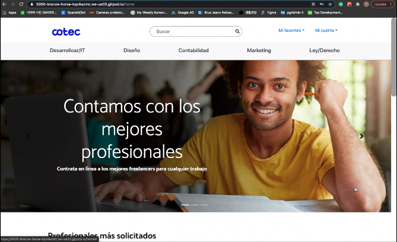

# Cotec - Freelancer, Client Web Matching & Selling Service

### Demo Video

- Backend: Using python, flask, PostgreSQL 
- Frontend: reactjs, Sass, Css, Bootstrp, Html, flux etc
- Full responsive application

### Front-End Manual Installation:
- Make sure you are using node version 14+ and that you have already successfully installed and runned the backend.
1. Install the packages: `$ npm install`
2. Start coding! start the webpack dev server `$ npm run start`

### Back-End Manual Installation (need to use Gitpod):
It is recomended to install the backend first, make sure you have Python 3.8, Pipenv and a database engine (Posgress recomended)
1. Install the python packages: `$ pipenv install`
2. Install psycopg2: `pipenv install psycopg2`
3. Creat a virtual envirment for backend: `pipenv shell`
4. Start the configuration of PostgreSQL: `psql`
5. Create database: `create database example;`
6. Finish the configuration of PostgreSQL: `\q`
7. Start Backend: `pipenv run init`
8. Migrate the migrations: `$ pipenv run migrate` 
(if you can not migrate the backend, you have to delete 'migrations' folder, and try it again from `pipenv run init`)
10. Run the migrations: `$ pipenv run upgrade`
11. Run the application: `$ pipenv run start`
